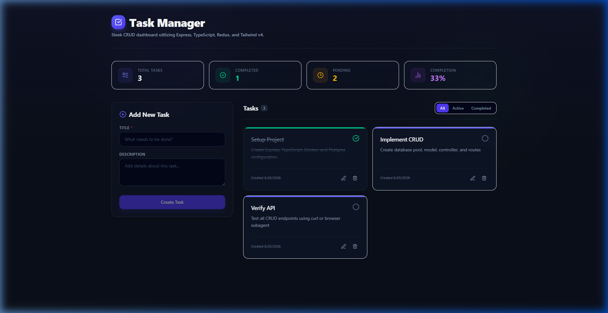
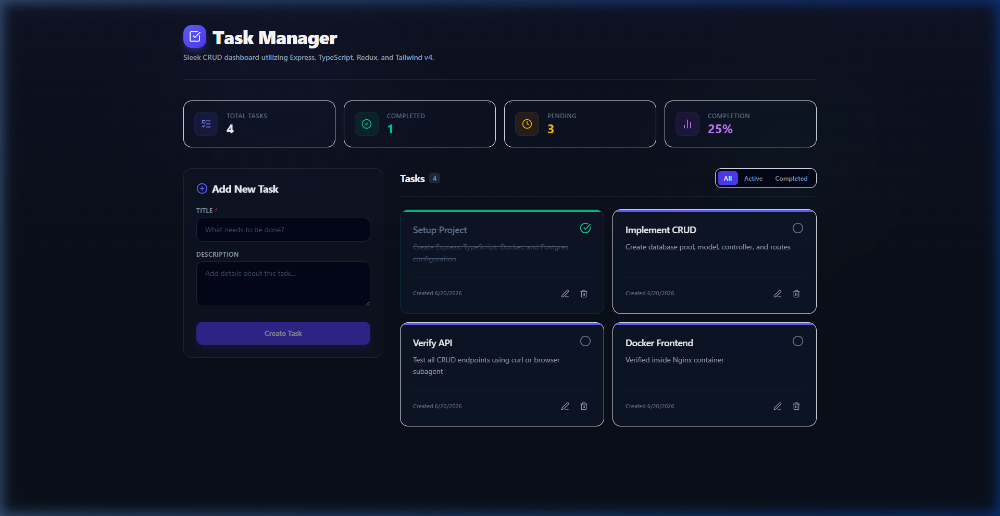
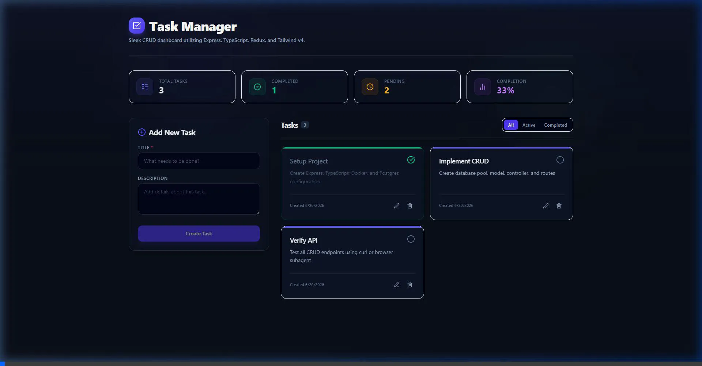

# Task Manager Dashboard — Sleek MVC Task Planner

A modern, full-stack Task CRUD application engineered with a clean Model-View-Controller (MVC) architecture on the client, robust TypeScript type safety across the stack, and fully containerized with Docker. Designed with a premium glassmorphic dark user interface, real-time progress indicators, and configured for automated continuous deployment (CI/CD) to AWS EC2 using GitHub Actions and Nginx.

[](https://www.typescriptlang.org/)
[](https://react.dev/)
[](https://redux-toolkit.js.org/)
[](https://tailwindcss.com/)
[](https://expressjs.com/)
[](https://www.postgresql.org/)
[](https://www.docker.com/)
[](https://aws.amazon.com/ec2/)
[](https://github.com/features/actions)

---

## 📸 Screenshots & Demos

### Dashboard Landing (Lightweight Seed Data)


### Real-Time Task Creation & State Updates


### Automated Integration & E2E Run


---

## ✨ Features

- **Premium Interface**: Responsive, interactive, glassmorphic dark-theme UI with hover micro-animations and glowing accents.
- **Task Statistics Widgets**: Real-time counter metrics tracking *Total Tasks*, *Completed Tasks*, and *Pending Tasks*.
- **Advanced State Management**: Powered by Redux Toolkit with asynchronous Redux Thunks for seamless server data sync.
- **Robust Clean Architecture**: Separation of concerns using Client-Side MVC architecture:
  - **Model**: Declares data interfaces and state slices.
  - **View**: Responsive, functional UI modules built on React 19 and Tailwind CSS v4.
  - **Controller**: Encapsulates component logic and API orchestration via custom React hooks.
- **Database Orchestration**: Fully automated initial setup using `init.sql` schema and automatic startup ordering through Docker service health checks.
- **Reverse Proxy Routing**: Configured Nginx internal routing to route traffic to the client dashboard (`/`) and API routes (`/api/*`).
- **DevSecOps/Automated CI/CD**: Automated GitHub Actions workflow checks TypeScript compilation on code pushes, connects to AWS EC2 via SSH, pulls new changes, updates containers, and prunes unused disk sectors.

---

## 🗂️ Project Structure

```text
.
├── .github/workflows/
│   └── deploy.yml          # GitHub Actions CI/CD Pipeline
├── assets/                 # Image assets for documentation
├── backend/
│   ├── src/
│   │   ├── config/db.ts    # Postgres Connection Pool configuration
│   │   ├── controllers/    # Task controller (CRUD operations)
│   │   ├── models/         # TypeScript Task Interfaces
│   │   ├── routes/         # Express router endpoints
│   │   └── index.ts        # Express Server bootstrapper
│   ├── Dockerfile          # Multi-stage production container build
│   ├── init.sql            # Postgres database structure & seed tasks
│   └── package.json
├── frontend/
│   ├── src/
│   │   ├── controllers/    # Custom hook controllers (e.g. task.controller.ts)
│   │   ├── models/         # Redux Toolkit store, slices, and typescript models
│   │   ├── views/          # React 19 Dashboard component views
│   │   ├── index.css       # Tailwind CSS v4 setup
│   │   └── main.tsx        # React entrypoint
│   ├── Dockerfile          # Multi-stage container build (Vite compiler -> Nginx host)
│   └── package.json
├── nginx/
│   └── nginx.conf          # Nginx reverse proxy configuration template
├── docker-compose.yml      # Orchestrates Postgres, Express Backend, and React Frontend
└── AWS_DEPLOYMENT_GUIDE.md # Comprehensive guide for EC2 deployment
```

---

## ⚙️ Environment Configuration

### Backend Environment Variables (`backend/.env`)
Create a `.env` file in the `backend/` directory:
```env
PORT=5000
DB_USER=postgres
DB_PASSWORD=postgres
DB_HOST=db             # Keep as 'db' when running Docker Compose
DB_PORT=5432
DB_NAME=taskdb
```

---

## 🚀 Quick Start (Local Docker Setup)

The entire application stack (Database, Backend API, Frontend Server) can be spin up locally with a single command:

### Prerequisites
- Install [Docker Desktop](https://www.docker.com/products/docker-desktop/) (includes Docker Compose).

### Launching the Stack
1. Clone the repository:
   ```bash
   git clone https://github.com/bilash-biswas/aws-server-deployment.git
   cd aws-server-deployment
   ```
2. Build and run containers in detached mode:
   ```bash
   docker compose up -d --build
   ```
3. Open your browser and access the services:
   - **Frontend App Dashboard**: [http://localhost:3000](http://localhost:3000)
   - **Backend API Endpoints**: [http://localhost:5000/api/tasks](http://localhost:5000/api/tasks)

4. Tear down containers:
   ```bash
   docker compose down -v
   ```

---

## 🔧 Manual Local Development

If you wish to run the backend and frontend separately outside of Docker containers:

### Prerequisites
- Node.js (v18+)
- PostgreSQL database instance running locally on port `5432`.

### 1. Database Setup
Create a database named `taskdb` and execute the schema initialization script:
```bash
psql -U postgres -d taskdb -f backend/init.sql
```

### 2. Run Backend API Server
1. Navigate to the backend directory and install dependencies:
   ```bash
   cd backend
   npm install
   ```
2. Create your `backend/.env` file and populate it (change `DB_HOST` to `localhost`).
3. Run the development server (auto-reloads on save):
   ```bash
   npm run dev
   ```

### 3. Run Frontend Dashboard
1. Open a new terminal window, navigate to the frontend directory:
   ```bash
   cd frontend
   npm install
   ```
2. Run the Vite development server:
   ```bash
   npm run dev
   ```
3. Open [http://localhost:5173](http://localhost:5173) in your browser.

---

## ☁️ AWS EC2 & CI/CD Deployment

For automated deployment to AWS EC2:

1. Follow the comprehensive, step-by-step setup details in [AWS_DEPLOYMENT_GUIDE.md](file:///e:/Express.js%20API/aws-server/AWS_DEPLOYMENT_GUIDE.md).
2. Configure your GitHub Repository Secrets:
   - `EC2_HOST`: Public IP/DNS of the EC2 instance.
   - `EC2_USERNAME`: `ubuntu`
   - `EC2_SSH_KEY`: Content of your `.pem` key file.
3. Every push to the `main` branch will automatically compile, test, transfer, build containers, and deploy in less than 2 minutes.

---

## 📝 API Reference

| Endpoint | Method | Description | Request Body |
| :--- | :--- | :--- | :--- |
| `/api/tasks` | `GET` | Get all tasks | *None* |
| `/api/tasks` | `POST` | Create a new task | `{ "title": "...", "description": "..." }` |
| `/api/tasks/:id` | `PUT` | Update a task title, description, or status | `{ "title": "...", "description": "...", "completed": true }` |
| `/api/tasks/:id` | `DELETE`| Remove a task | *None* |
